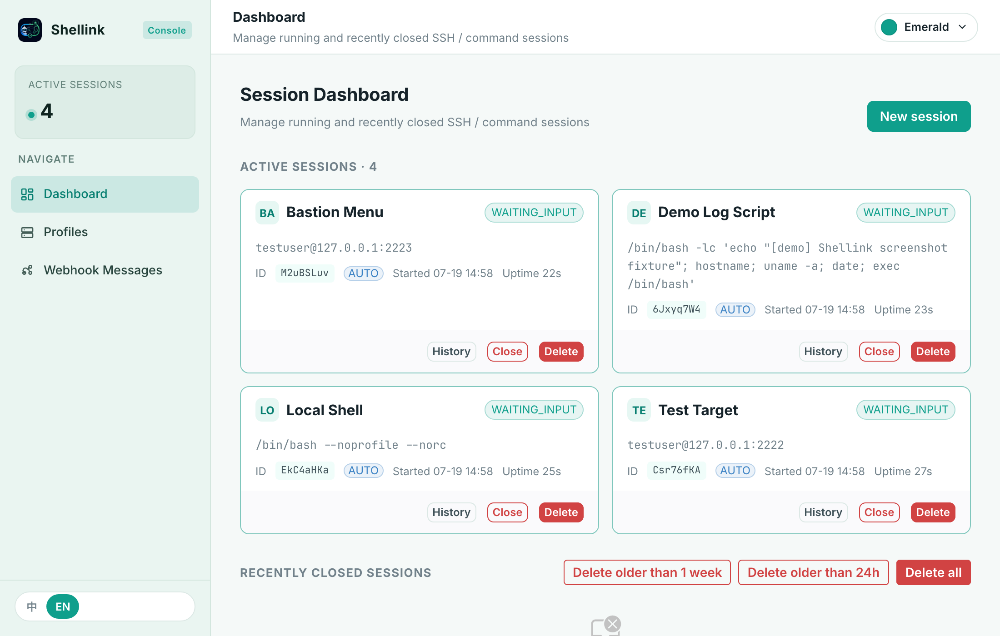
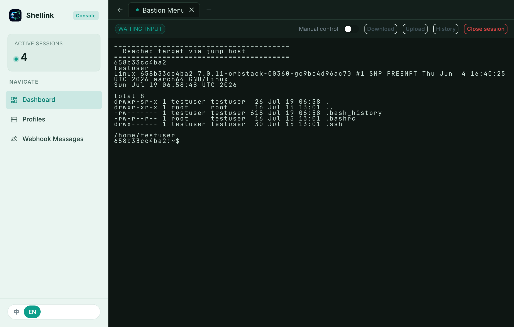
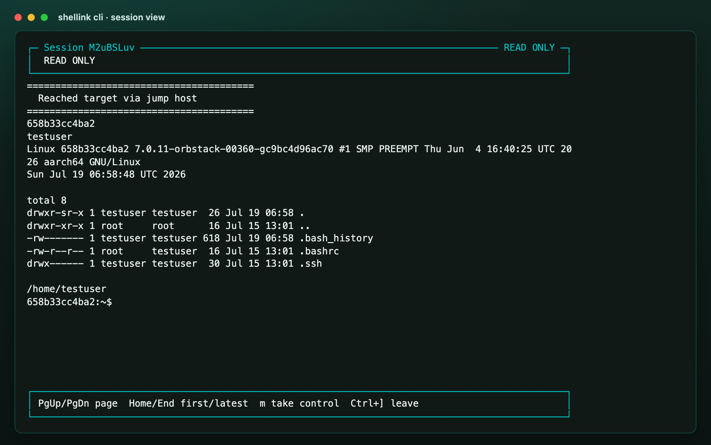
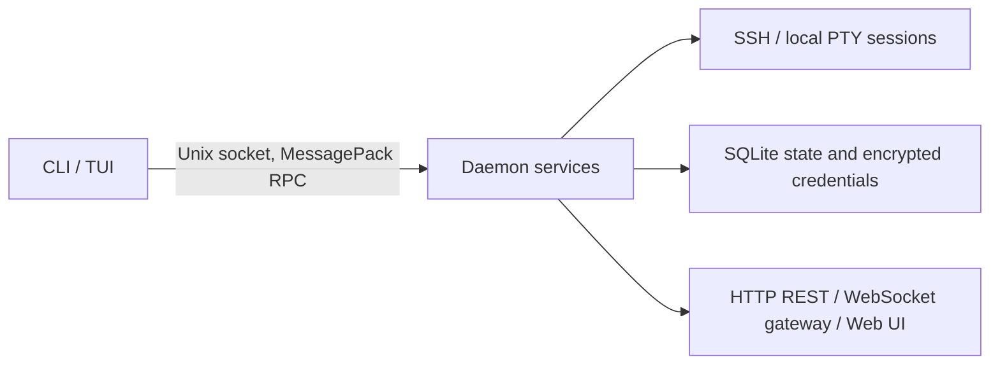

<div align="center">


# Shellink

**One stable CLI and daemon for SSH, local PTY sessions, file transfer, and remote editing — built for AI agents and humans alike.**

[](LICENSE)
[](https://nodejs.org/)
[](https://www.typescriptlang.org/)
[](#contributing)

[Features](#features) ·
[Quick Start](#quick-start) ·
[Documentation](#table-of-contents) ·
[Contributing](#contributing) ·
[中文文档](README.zh-CN.md)

</div>

Shellink is an open-source session middleware for AI agents and humans working with SSH and local terminal sessions. It provides one stable CLI for connection profiles, interactive sessions, command execution, file transfer, remote editing, and session state. A local daemon owns the sessions and exposes a browser-friendly Web UI plus HTTP and WebSocket compatibility APIs.

Repository: <https://github.com/jie123108/Shellink>

> **Security warning:** `command` profiles execute their configured command as the server process user. Run Shellink only in a trusted environment and protect `SHELLINK_TOKEN`. Shellink also lets an AI agent connect directly to production servers; this carries real operational risk, so prefer read-only, inspection, or analysis operations, or point the agent at non-production environments.

## Table of Contents

- [Shellink](#shellink)
  - [Table of Contents](#table-of-contents)
  - [Screenshots](#screenshots)
  - [Features](#features)
  - [Why Shellink Is Designed for AI Agents](#why-shellink-is-designed-for-ai-agents)
  - [Architecture](#architecture)
  - [Technology Stack](#technology-stack)
  - [Installation](#installation)
    - [Install binary (recommended)](#install-binary-recommended)
    - [From source](#from-source)
  - [Quick Start](#quick-start)
  - [Usage](#usage)
    - [Custom Command Profiles](#custom-command-profiles)
    - [Client and Server Modes](#client-and-server-modes)
      - [Client mode](#client-mode)
      - [Server mode](#server-mode)
    - [HTTP Endpoints](#http-endpoints)
    - [AI Agent Workflow](#ai-agent-workflow)
    - [Agent Skills](#agent-skills)
      - [`shellink-cli`](#shellink-cli)
      - [`shellink-iterm2-import`](#shellink-iterm2-import)
  - [Environment Variables](#environment-variables)
  - [Development](#development)
  - [Tests and Coverage](#tests-and-coverage)
  - [Contributing](#contributing)
  - [License](#license)

## Screenshots

Web UI dashboard (session list):



Web UI live session terminal (xterm.js), including a jump-host hop:



CLI/TUI session view (`shellink cli`):



## Features

- **SSH and custom command sessions:** Connect directly with SSH, or run a command/script inside a PTY.
- **Multi-hop login automation:** `connectType: "command"` supports `expect` and similar scripts for multi-level bastion hosts, jump-host menus, OTP prompts, and legacy authentication flows.
- **Command execution and state handling:** Execute commands, inspect state, provide interactive input, and wait for the session to become ready before the next operation.
- **File transfer across jump hosts:** Upload and download files through the existing PTY instead of requiring SFTP. This keeps transfers working through custom command chains and multi-hop connections.
- **Remote file editing:** Apply precise replacements with `shellink session edit`.
- **Audit history and supervision:** Session input/output is retained as history for audit and replay, while `MANUAL` mode lets a human take control and supervise or answer prompts.
- **CLI/TUI, Web UI, REST, and WebSocket:** Use the interface that fits the workflow, with stable `--json` output for automation.
- **Encrypted profiles and optional single-file binaries:** Credentials are protected in SQLite, and Bun builds are available for macOS and Linux.

## Why Shellink Is Designed for AI Agents

Shellink is designed around the situations where an AI agent needs reliable access but should not guess or bypass human controls:

- **Scriptable multi-hop access:** Agents can reuse `expect` or other custom login scripts for several bastion hops instead of implementing each site's authentication flow themselves.
- **PTY-based continuity:** Commands and file transfers use the same PTY path, so an agent can work through jump hosts even when no direct SFTP or SSH endpoint is available.
- **Human supervision:** `AUTO` mode is for agent actions; `MANUAL` mode hands the terminal to a person for approval, OTP entry, or intervention before automation continues.
- **Auditable operations:** Session input/output history and daemon logs give operators a record for reviewing what the agent saw and did.
- **Observable progress:** Explicit session states and machine-readable CLI output let an agent decide whether to execute, send input, wait, or ask for human help.

## Architecture

The repository is an npm workspace monorepo with one additional non-workspace directory for agent skills:

| Path | Type | Responsibility |
| --- | --- | --- |
| `protocol/` | npm workspace | Versioned RPC methods, MessagePack frames, and Zod schemas |
| `cli/` | npm workspace | `shellink` CLI, daemon lifecycle commands, and terminal UI |
| `server/` | npm workspace | Unix-socket daemon, session engine, services, HTTP, and WebSocket gateway |
| `web/` | npm workspace | Vue 3 browser console with xterm.js |
| `skills/` | plain directory | Agent skills for remote operations and iTerm2 profile import |

The runtime flow is:



The Unix socket is the primary local interface. HTTP, WebSocket, and the Web UI are compatibility and browser layers. New local automation should use the CLI rather than implementing the socket protocol directly.

## Technology Stack

- **Runtime:** Node.js `>=22.19.0`; Bun is optional for compiled binaries.
- **Language:** TypeScript with npm workspaces.
- **Server:** Fastify, `ssh2`, `node-pty`, `ws`, SQLite via `better-sqlite3` and Drizzle ORM.
- **Protocol:** MessagePack framing and Zod validation.
- **Web:** Vue 3, Vite, Naive UI, Pinia, and xterm.js.
- **Testing:** Vitest with V8 coverage and Docker-backed end-to-end fixtures.

## Installation

> **Using an AI coding agent?** Paste this prompt into your agent's chat:
>
> ```text
> Please help me install Shellink and its skills by following https://raw.githubusercontent.com/jie123108/Shellink/main/AGENTS_INSTALL.md
> ```

### Install binary (recommended)

Prebuilt binaries are published for macOS and Linux (`darwin-arm64`, `darwin-x64`, `linux-arm64`, `linux-x64`). Windows is not supported; build from source instead (see below).

```bash
curl -fsSL https://raw.githubusercontent.com/jie123108/Shellink/main/install.sh -o /tmp/shellink-install.sh
cat /tmp/shellink-install.sh
sh /tmp/shellink-install.sh
```

Pin a release tag if needed:

```bash
curl -fsSL https://raw.githubusercontent.com/jie123108/Shellink/main/install.sh -o /tmp/shellink-install.sh
cat /tmp/shellink-install.sh
sh /tmp/shellink-install.sh --version v0.1.0
```

For a system-wide install into `/usr/local/bin` (already on `PATH` on most systems), run with `sudo`:

```bash
sudo sh /tmp/shellink-install.sh --dir /usr/local/bin
```

The script downloads the matching asset from GitHub Releases, verifies `SHA256SUMS.txt`, and installs `shellink` to `$HOME/.local/bin` by default. If that directory is not on `PATH`, the installer appends an `export PATH=...` line to your shell profile (`~/.zshrc`, `~/.bashrc`, etc.). Open a new shell (or re-export `PATH`), then verify:

```bash
shellink -V
```

### From source

Requirements:

- Node.js 22.19 or newer.
- npm.
- Docker, only if you want to run the Docker-backed end-to-end tests.
- Bun, only if you want to build a standalone binary.

```bash
git clone https://github.com/jie123108/Shellink.git
cd Shellink
npm install
npm run build
```

The built CLI is available at `./node_modules/.bin/shellink`. To build a standalone executable for the current platform:

```bash
npm run build:binary
mkdir -p "$HOME/.local/bin"
cp dist/shellink "$HOME/.local/bin/shellink"
export PATH="$HOME/.local/bin:$PATH"
```

Cross-build scripts are available for `macos-arm64`, `macos-x64`, `linux-arm64`, and `linux-x64`.

## Quick Start

Start the interactive terminal UI. It starts the user-level daemon automatically when necessary:

```bash
shellink cli
```

Check the daemon and print the machine-readable agent reference:

```bash
shellink server status --json
shellink agent-doc
```

Create a command profile and session without putting credentials in shell history:

```bash
shellink profile create --input - --json <<'JSON'
{"name":"local-shell","connectType":"command","command":"/bin/sh"}
JSON

shellink profile list --query local --json
shellink session create --profile <profile-id> --json
shellink session exec <session-id> --command 'uname -a' --json
shellink session close <session-id> --json
```

For SSH profiles, pass passwords, passphrases, and private keys through `--input FILE` or stdin. Never put them in command-line arguments.

When running from source, `npm run dev` starts the server and Vite development UI. Open `http://localhost:5173`. A built daemon serves the embedded UI at `http://127.0.0.1:7070/shellink/ui/` by default; the exact URL is shown by `shellink server run` or `shellink server status --json`.

## Usage

### Custom Command Profiles

Custom command profiles are intended for connections that cannot be represented by a single direct SSH login. Set `connectType` to `command` and provide any command available on the server host, for example:

```json
{
  "name": "Bastion menu",
  "connectType": "command",
  "command": "expect /opt/shellink/login-through-bastion.exp"
}
```

Shellink starts the command in a PTY and exposes the same command, input, history, file-transfer, and editing APIs used by SSH sessions. An `expect` script can therefore drive several bastion hosts and authentication steps as one Shellink session. The script, its dependencies, and its credentials run on the server host as the daemon user; only execute trusted commands.

### Client and Server Modes

#### Client mode

The `shellink` executable is the client. TUI commands and resource commands (`profile`, `session`, and `webhook`) connect to the local daemon through a Unix socket. If the socket is unavailable, the client starts a detached daemon, waits for it to become ready, and then sends the request. Add `--json` for stable, one-line machine-readable output.

#### Server mode

```bash
shellink server start                 # Start in the background
shellink server status --json         # Inspect health and active sessions
shellink server logs --lines 100      # Read recent daemon logs
shellink server restart               # Restart the daemon
shellink server stop                  # Stop the daemon
shellink server run                   # Run in the foreground
```

`server run` is suitable for development or a process manager. The daemon always starts its Unix socket. HTTP/WebSocket support is enabled by default and can be disabled with `SHELLINK_HTTP_ENABLED=false`. HTTP binds to `127.0.0.1` by default; set `SHELLINK_HOST=0.0.0.0` only when remote access is intentional.

Local requests from `localhost` or `127.0.0.1` can omit authentication, including permanent session-record deletes. Remote HTTP and WebSocket requests require `Authorization: Bearer <SHELLINK_TOKEN>` (or the WebSocket token query parameter used by existing clients). The Web UI probes `GET /shellink/api/auth/sensitive-ops` to decide whether a token is required for delete/purge actions.

When nginx (or another reverse proxy) sits in front, the backend usually sees a loopback TCP peer but a public `Host` header. That is treated as remote access: sensitive ops still require a token. `X-Forwarded-For` / `X-Real-IP` are not trusted for the local bypass.

### HTTP Endpoints

All HTTP, WebSocket, and Web UI routes are served under the `/shellink` prefix:

| Path | Description |
| --- | --- |
| `/shellink/ui/` | Embedded Web UI (browser console) |
| `/shellink/api/*` | REST compatibility API (profiles, sessions, webhooks, auth) |
| `/shellink/ws/sessions/{id}` | Per-session terminal WebSocket stream |
| `/shellink/ws/events` | Global session-state event WebSocket stream |
| `/shellink/agent.md`, `/shellink/llms.txt` | Machine-readable agent reference (same content as `shellink agent-doc`) |
| `/shellink/healthz` | Liveness probe |

### AI Agent Workflow

Use the installed reference before integrating:

```bash
shellink agent-doc
```

The recommended flow is to search profiles, create a session, wait for `WAITING_INPUT`, execute commands, inspect history when needed, and close the session. Session states are `CONNECTING`, `OUTPUTTING`, `WAITING_INPUT`, `IDLE`, and `DISCONNECTED`; interaction modes are `AUTO` and `MANUAL`.

Important commands include:

```bash
shellink profile list --query '<name, host, or command>' --json
shellink session create --profile <profile-id> --json
shellink session state <session-id> --json
shellink session exec <session-id> --command 'ls -la' --json
shellink session input <session-id> --text 'yes' --json
shellink session history <session-id> --since 0 --json
shellink session download <session-id> --path /remote/file --output ./file --json
shellink session upload <session-id> --input ./file --path /remote/file --json
shellink session edit <session-id> --input edits.json --json
shellink session close <session-id> --json
```

Remote editing accepts exact, non-overlapping replacements and requires an `AUTO` session in `WAITING_INPUT`.

### Agent Skills

The repository includes two skills under `skills/`. Install with the
[`skills`](https://skills.sh/) CLI (`npx`). Always pass `--skill` so only the
matching subdirectory is installed (the repo contains more than one skill).

```bash
# List available skills
npx skills add jie123108/Shellink --list

# shellink-cli (Codex example; see skills/shellink-cli/README.md for other agents)
npx skills add jie123108/Shellink --skill shellink-cli --agent codex
npx skills add jie123108/Shellink --skill shellink-cli --agent codex -g

# shellink-iterm2-import
npx skills add jie123108/Shellink --skill shellink-iterm2-import --agent codex

# Update
npx skills update shellink-cli
npx skills update shellink-iterm2-import
```

Per-agent install and update commands (Cursor, Claude Code, Codex, Pi, Trae,
Antigravity, OpenClaw) are documented in
[`skills/shellink-cli/README.md`](skills/shellink-cli/README.md).

#### `shellink-cli`

Use this skill for profiles, SSH or command sessions, interactive input, file transfer, and remote editing. It requires a working `shellink` executable on `PATH`.

#### `shellink-iterm2-import`

Use this skill on macOS to scan and import iTerm2 Profiles and DynamicProfiles:

```bash
python3 skills/shellink-iterm2-import/scripts/import_iterm2.py --json
python3 skills/shellink-iterm2-import/scripts/import_iterm2.py --dry-run --name "Production"
python3 skills/shellink-iterm2-import/scripts/import_iterm2.py --guid <guid>
```

It requires Python 3.9 or newer and an available `shellink` executable. Review scan results before using `--all`. Re-imports match by `uniqueId` (iTerm2 Guid) first, then by name; matching profiles are updated by default. iTerm2 passwords are not exported; add them later through the Web UI when necessary.

## Environment Variables

| Variable | Description | Default |
| --- | --- | --- |
| `SHELLINK_HOME` | Data, master-key, and PID directory | `$HOME/.Shellink` |
| `SHELLINK_SOCKET` | Unix socket path | Platform-specific runtime path |
| `SHELLINK_LOG` | Daemon log path | `$SHELLINK_HOME/shellink.log` |
| `SHELLINK_HTTP_ENABLED` | Enable HTTP/WebSocket compatibility services | `true` |
| `SHELLINK_HOST` | HTTP bind address | `127.0.0.1` |
| `SHELLINK_PORT` | HTTP port | `7070` |
| `SHELLINK_TOKEN` | API and Web UI token for remote access | `change-me` |
| `SHELLINK_REQUIRE_TOKEN_FOR_SENSITIVE_OPS` | Force token for session delete/purge (`true`/`false`); unset derives from local vs remote | derived from request |
| `SHELLINK_MASTER_KEY` | 32-byte key as 64 hex characters | Generated on first start |
| `SHELLINK_DB` | SQLite database path override | `$SHELLINK_HOME/shellink.db` |
| `SHELLINK_MAX_FRAME_BYTES` | Maximum RPC payload | `16777216` |
| `SHELLINK_SOCKET_MAX_QUEUE_BYTES` | Maximum buffered bytes per Unix-socket client before backpressure | `4194304` |
| `SHELLINK_SILENCE_MS` | Quiet-period threshold for state detection | `800` |
| `SHELLINK_EXEC_TIMEOUT_MS` | Default command timeout | `30000` |
| `SHELLINK_TRANSFER_MAX_BYTES` | Maximum upload/download size | `6291456` |
| `SHELLINK_TRANSFER_TIMEOUT_MS` | Default transfer timeout | `120000` |
| `SHELLINK_EDIT_TIMEOUT_MS` | Default remote-edit timeout | `60000` |
| `SHELLINK_SSH_READY_TIMEOUT_MS` | SSH readiness timeout | `30000` |

For production, set `SHELLINK_MASTER_KEY` explicitly and keep it stable for the lifetime of the database. The generated key is stored as `$SHELLINK_HOME/master.key` with restrictive permissions.

## Development

```bash
npm run dev                 # Server and Web UI
npm run dev:server         # Server only
npm run dev:web            # Web UI only
npm run build              # Production runtime build
```

## Tests and Coverage

The project has unit, integration, protocol, CLI/TUI, WebSocket, and Docker-backed end-to-end tests.

```bash
npm run test:protocol
npm run test:server
npm run test --workspace=cli
npm run test:server:coverage
npm run test:coverage:full --workspace=server
```

Server coverage uses Vitest's V8 provider and enforces these thresholds:

| Metric | Threshold |
| --- | ---: |
| Lines | 98% |
| Statements | 98% |
| Functions | 97% |
| Branches | 90% |

`test:server:coverage` excludes the long-running `extreme` and `abnormal` E2E suites. Use `test:coverage:full` when Docker and the full integration environment are available. HTML and JSON coverage reports are written under `server/coverage/`.

## Contributing

Bug reports, feature proposals, tests, and documentation improvements are welcome. Please keep credentials out of commits, run the relevant test and build commands before submitting changes, and keep protocol changes synchronized across `protocol/`, `cli/`, and `server/`. Every code submission must include corresponding unit tests, and must not lower any of the coverage thresholds listed above.

## License

Shellink is licensed under the [MIT License](LICENSE).
