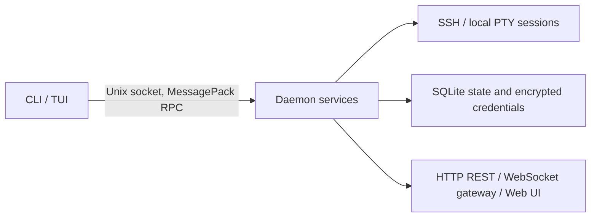

<div align="center">


# Shellink

**面向 AI 智能体（AI Agent）与人类用户的统一 CLI 与守护进程（daemon）— 支持 SSH、本地伪终端（PTY）会话、文件传输与远程编辑。**

[](LICENSE)
[](https://nodejs.org/)
[](https://www.typescriptlang.org/)
[](#贡献指南-contributing)

[特性](#特性-features) ·
[快速开始](#快速开始-quick-start) ·
[文档](#目录) ·
[贡献指南](#贡献指南-contributing) ·
[English README](README.md)

</div>

Shellink 是一个面向 AI 智能体（AI Agent）与人类用户的开源会话中间件（session middleware），用于操作 SSH 与本地终端会话（session）。它提供统一稳定的命令行（CLI）来管理连接配置（profile）、交互式会话、命令执行、文件传输、远程编辑与会话状态。本地守护进程（daemon）负责持有会话，并对外提供浏览器友好的 Web 控制台，以及兼容的 HTTP 和 WebSocket API。

代码仓库：<https://github.com/jie123108/Shellink>

> **安全警告：** `command` 类型的连接配置（profile）会以服务器进程所属用户的身份执行其配置的命令。请仅在受信任的环境中运行 Shellink，并妥善保护 `SHELLINK_TOKEN`。此外，Shellink 允许 AI 智能体（AI Agent）直接连接生产（production）服务器，这存在实际的操作风险；建议仅让智能体进行只读、检查或分析类操作，或将其指向非生产环境。

## 目录

- [Shellink](#shellink)
  - [目录](#目录)
  - [截图（Screenshots）](#截图screenshots)
  - [特性（Features）](#特性features)
  - [为什么 Shellink 专为 AI 智能体设计](#为什么-shellink-专为-ai-智能体设计)
  - [架构（Architecture）](#架构architecture)
  - [技术栈（Technology Stack）](#技术栈technology-stack)
  - [安装（Installation）](#安装installation)
    - [安装预编译二进制（推荐）](#安装预编译二进制推荐)
    - [从源码安装](#从源码安装)
  - [快速开始（Quick Start）](#快速开始quick-start)
  - [使用方法（Usage）](#使用方法usage)
    - [自定义命令连接配置（Custom Command Profiles）](#自定义命令连接配置custom-command-profiles)
    - [客户端与服务端模式（Client and Server Modes）](#客户端与服务端模式client-and-server-modes)
      - [客户端模式（Client mode）](#客户端模式client-mode)
      - [服务端模式（Server mode）](#服务端模式server-mode)
    - [HTTP 接口（HTTP Endpoints）](#http-接口http-endpoints)
    - [AI 智能体工作流（AI Agent Workflow）](#ai-智能体工作流ai-agent-workflow)
    - [Agent 技能（Skills）](#agent-技能skills)
      - [`shellink-cli`](#shellink-cli)
      - [`shellink-iterm2-import`](#shellink-iterm2-import)
  - [环境变量（Environment Variables）](#环境变量environment-variables)
  - [开发（Development）](#开发development)
  - [测试与覆盖率（Tests and Coverage）](#测试与覆盖率tests-and-coverage)
  - [贡献指南（Contributing）](#贡献指南contributing)
  - [许可证（License）](#许可证license)

## 截图（Screenshots）

Web UI 仪表盘（会话列表）：


Web UI 实时会话终端（xterm.js，含跳板机跳转）：


CLI/TUI 会话视图（`shellink cli`）：


## 特性（Features）

- **SSH 与自定义命令会话（session）：** 可直接通过 SSH 连接，也可以在伪终端（PTY）中运行任意命令或脚本。
- **多级跳转登录自动化（multi-hop login automation）：** `connectType: "command"` 支持 `expect` 及类似脚本，用于多级跳板机（bastion host）、跳转主机菜单、一次性密码（OTP）提示以及各类传统认证流程。
- **命令执行与状态管理：** 执行命令、查看状态、提供交互式输入，并在下一步操作前等待会话进入就绪状态。
- **跨跳板机的文件传输：** 通过已建立的伪终端（PTY）上传和下载文件，而无需依赖 SFTP。这使得文件传输在自定义命令链与多级跳转连接下依然可用。
- **远程文件编辑：** 使用 `shellink session edit` 进行精确的内容替换。
- **审计历史与人工监督：** 会话的输入/输出会保留为历史记录，用于审计与回放；`MANUAL`（人工）模式允许人工接管终端，进行监督或应答提示。
- **CLI/TUI、Web UI、REST 与 WebSocket：** 可根据工作流选择合适的接口，并通过稳定的 `--json` 输出支持自动化处理。
- **加密的连接配置与可选的单文件二进制：** 凭据（credential）通过 SQLite 加密保护，且 macOS 与 Linux 上均提供基于 Bun 构建的独立二进制文件。

## 为什么 Shellink 专为 AI 智能体设计

Shellink 的设计围绕这样一种场景：AI 智能体（AI Agent）需要可靠的访问能力，但不应自行猜测或绕过人工控制：

- **可脚本化的多级跳转访问：** 智能体可以复用 `expect` 或其他自定义登录脚本来完成多级跳板机（bastion host）跳转，而无需自行实现每个站点的认证流程。
- **基于伪终端（PTY）的连续性：** 命令执行与文件传输使用同一条伪终端（PTY）路径，因此即便没有直接可用的 SFTP 或 SSH 端点，智能体依然可以通过跳板机完成操作。
- **人工监督（human supervision）：** `AUTO`（自动）模式供智能体操作使用；`MANUAL`（人工）模式会将终端交给人工，以便在自动化继续之前完成审批、输入一次性密码（OTP）或进行干预。
- **可审计的操作：** 会话输入/输出历史与守护进程（daemon）日志为运维人员提供了审查智能体所见所为的记录。
- **可观测的进度：** 明确的会话状态与机器可读的 CLI 输出，让智能体能够判断是执行命令、发送输入、等待，还是请求人工介入。

## 架构（Architecture）

本仓库是一个 npm 工作区（workspace）单体仓库（monorepo），另外还包含一个不属于工作区的目录，用于存放智能体技能（agent skills）：

| 路径 | 类型 | 职责 |
| --- | --- | --- |
| `protocol/` | npm 工作区（workspace） | 带版本管理的 RPC 方法、MessagePack 帧格式以及 Zod 模式（schema） |
| `cli/` | npm 工作区（workspace） | `shellink` 命令行（CLI）、守护进程（daemon）生命周期管理命令以及终端界面（TUI） |
| `server/` | npm 工作区（workspace） | 基于 Unix 套接字（Unix socket）的守护进程（daemon）、会话引擎、各类服务、HTTP 与 WebSocket 网关 |
| `web/` | npm 工作区（workspace） | 基于 Vue 3 与 xterm.js 的浏览器控制台 |
| `skills/` | 普通目录 | 用于远程操作以及 iTerm2 连接配置导入的智能体技能（agent skills） |

运行时的整体流程如下：



Unix 套接字（Unix socket）是主要的本地接口。HTTP、WebSocket 与 Web UI 属于兼容层与浏览器接入层。新的本地自动化脚本应优先使用 CLI，而不是直接实现套接字协议。

## 技术栈（Technology Stack）

- **运行时（Runtime）：** Node.js `>=22.19.0`；Bun 为可选项，用于构建编译后的二进制文件。
- **语言：** TypeScript，配合 npm 工作区（workspaces）。
- **服务端（Server）：** Fastify、`ssh2`、`node-pty`、`ws`，以及通过 `better-sqlite3` 和 Drizzle ORM 使用的 SQLite。
- **协议（Protocol）：** MessagePack 帧格式与 Zod 校验。
- **Web 端：** Vue 3、Vite、Naive UI、Pinia 以及 xterm.js。
- **测试：** Vitest，配合 V8 覆盖率工具与基于 Docker 的端到端（end-to-end）测试夹具（fixture）。

## 安装（Installation）

> **在用 AI 编程助手？** 把下面这句话粘贴到对话里：
>
> ```text
> 请帮我安装 Shellink 及其 skills，参考这份文档：https://raw.githubusercontent.com/jie123108/Shellink/main/AGENTS_INSTALL.md
> ```

### 安装预编译二进制（推荐）

已发布 macOS / Linux 预编译包（`darwin-arm64`、`darwin-x64`、`linux-arm64`、`linux-x64`）。暂不支持 Windows，请从源码构建（见下文）。

```bash
curl -fsSL https://raw.githubusercontent.com/jie123108/Shellink/main/install.sh -o /tmp/shellink-install.sh
cat /tmp/shellink-install.sh
sh /tmp/shellink-install.sh
```

如需固定版本：

```bash
curl -fsSL https://raw.githubusercontent.com/jie123108/Shellink/main/install.sh -o /tmp/shellink-install.sh
cat /tmp/shellink-install.sh
sh /tmp/shellink-install.sh --version v0.1.0
```

若要安装到系统目录 `/usr/local/bin`（多数系统已在 `PATH` 中），请用 `sudo` 运行：

```bash
sudo sh /tmp/shellink-install.sh --dir /usr/local/bin
```

脚本会从 GitHub Releases 下载对应平台二进制，校验 `SHA256SUMS.txt`，默认安装为 `$HOME/.local/bin/shellink`。若该目录不在 `PATH` 中，安装脚本会自动把 `export PATH=...` 写入你的 shell 配置（`~/.zshrc`、`~/.bashrc` 等）。打开新的 shell（或重新 export `PATH`）后验证：

```bash
shellink -V
```

### 从源码安装

环境要求：

- Node.js 22.19 或更高版本。
- npm。
- Docker（仅当你需要运行基于 Docker 的端到端测试时才需要）。
- Bun（仅当你需要构建独立二进制文件时才需要）。

```bash
git clone https://github.com/jie123108/Shellink.git
cd Shellink
npm install
npm run build
```

构建完成后的 CLI 位于 `./node_modules/.bin/shellink`。若要为当前平台构建独立可执行文件：

```bash
npm run build:binary
mkdir -p "$HOME/.local/bin"
cp dist/shellink "$HOME/.local/bin/shellink"
export PATH="$HOME/.local/bin:$PATH"
```

针对 `macos-arm64`、`macos-x64`、`linux-arm64` 和 `linux-x64` 均提供了交叉构建（cross-build）脚本。

## 快速开始（Quick Start）

启动交互式终端界面（TUI）。必要时它会自动启动用户级守护进程（daemon）：

```bash
shellink cli
```

检查守护进程状态并打印机器可读的智能体参考文档：

```bash
shellink server status --json
shellink agent-doc
```

创建命令类型的连接配置（command profile）与会话，且不将凭据（credential）留在 shell 历史记录中：

```bash
shellink profile create --input - --json <<'JSON'
{"name":"local-shell","connectType":"command","command":"/bin/sh"}
JSON

shellink profile list --query local --json
shellink session create --profile <profile-id> --json
shellink session exec <session-id> --command 'uname -a' --json
shellink session close <session-id> --json
```

对于 SSH 类型的连接配置（profile），请通过 `--input FILE` 或标准输入（stdin）传递密码、密钥口令（passphrase）与私钥。切勿将它们放在命令行参数中。

从源码运行时，`npm run dev` 会同时启动服务端与 Vite 开发环境下的 Web UI。打开 `http://localhost:5173`。构建完成后的守护进程默认会在 `http://127.0.0.1:7070/shellink/ui/` 提供内嵌的 Web UI；具体地址会通过 `shellink server run` 或 `shellink server status --json` 显示。

## 使用方法（Usage）

### 自定义命令连接配置（Custom Command Profiles）

自定义命令连接配置（profile）适用于无法用一次直接 SSH 登录来表示的连接场景。将 `connectType` 设置为 `command`，并提供服务器主机上可用的任意命令，例如：

```json
{
  "name": "Bastion menu",
  "connectType": "command",
  "command": "expect /opt/shellink/login-through-bastion.exp"
}
```

Shellink 会在伪终端（PTY）中启动该命令，并暴露出与 SSH 会话相同的命令执行、输入、历史记录、文件传输与编辑 API。因此，一个 `expect` 脚本可以驱动多个跳板机（bastion host）与多步认证流程，将其整合为一个 Shellink 会话。该脚本、其依赖项以及其中的凭据（credential）都会以守护进程（daemon）所属用户的身份在服务器主机上运行；请只执行可信的命令。

> **说明：** Shellink 本身不处理主机的自动登录过程。对于自动登录（多级跳转、跳板机菜单、一次性密码（OTP）提示以及其他交互式认证流程），建议使用由 `command` 类型连接配置驱动的 [`expect`](https://linux.die.net/man/1/expect) 脚本来处理。视具体环境，也可以使用其他工具，例如 `sshpass`（仅密码登录）或结合密钥认证与 `ProxyJump`/`ProxyCommand` 的 `ssh`。

### 客户端与服务端模式（Client and Server Modes）

#### 客户端模式（Client mode）

`shellink` 可执行文件即为客户端。TUI 命令与资源相关命令（`profile`、`session`、`webhook`）通过 Unix 套接字（Unix socket）连接本地守护进程（daemon）。如果套接字不可用，客户端会以后台（detached）方式启动守护进程，等待其就绪后再发送请求。加上 `--json` 参数可获得稳定的、单行的机器可读输出。

#### 服务端模式（Server mode）

```bash
shellink server start                 # 在后台启动
shellink server status --json         # 查看健康状态与活跃会话
shellink server logs --lines 100      # 查看最近的守护进程日志
shellink server restart               # 重启守护进程
shellink server stop                  # 停止守护进程
shellink server run                   # 在前台运行
```

`server run` 适用于开发环境或进程管理器（process manager）场景。守护进程始终会启动其 Unix 套接字。HTTP/WebSocket 支持默认启用，可通过 `SHELLINK_HTTP_ENABLED=false` 禁用。HTTP 默认绑定到 `127.0.0.1`；仅在确实需要远程访问时，才设置 `SHELLINK_HOST=0.0.0.0`。

来自 `localhost` 或 `127.0.0.1` 的本地请求可以免鉴权，包括永久性的会话记录删除操作。远程 HTTP 与 WebSocket 请求需要携带 `Authorization: Bearer <SHELLINK_TOKEN>`（或现有客户端使用的 WebSocket token 查询参数）。Web UI 会探测 `GET /shellink/api/auth/sensitive-ops` 接口，以决定删除/清除等操作是否需要 token。

当 nginx（或其他反向代理）位于前端时，后端通常看到的是回环（loopback）TCP 连接对端，但 `Host` 请求头却是公共域名。这种情况会被视为远程访问：敏感操作仍然需要 token。本地免鉴权判断不会信任 `X-Forwarded-For` / `X-Real-IP` 请求头。

### HTTP 接口（HTTP Endpoints）

所有 HTTP、WebSocket 与 Web UI 路由都统一挂载在 `/shellink` 前缀下：

| 路径 | 说明 |
| --- | --- |
| `/shellink/ui/` | 内嵌的 Web UI（浏览器控制台） |
| `/shellink/api/*` | REST 兼容 API（连接配置、会话、Webhook、鉴权） |
| `/shellink/ws/sessions/{id}` | 单个会话的终端 WebSocket 流 |
| `/shellink/ws/events` | 全局会话状态事件 WebSocket 流 |
| `/shellink/agent.md`、`/shellink/llms.txt` | 机器可读的智能体参考文档（内容与 `shellink agent-doc` 相同） |
| `/shellink/healthz` | 存活探针（liveness probe） |

### AI 智能体工作流（AI Agent Workflow）

在集成之前，请先使用已安装的参考文档：

```bash
shellink agent-doc
```

推荐的流程是：搜索连接配置（profile）、创建会话、等待进入 `WAITING_INPUT` 状态、执行命令、必要时查看历史记录，最后关闭会话。会话状态包括 `CONNECTING`（连接中）、`OUTPUTTING`（输出中）、`WAITING_INPUT`（等待输入）、`IDLE`（空闲）和 `DISCONNECTED`（已断开）；交互模式分为 `AUTO`（自动）与 `MANUAL`（人工）。

常用命令包括：

```bash
shellink profile list --query '<name, host, or command>' --json
shellink session create --profile <profile-id> --json
shellink session state <session-id> --json
shellink session exec <session-id> --command 'ls -la' --json
shellink session input <session-id> --text 'yes' --json
shellink session history <session-id> --since 0 --json
shellink session download <session-id> --path /remote/file --output ./file --json
shellink session upload <session-id> --input ./file --path /remote/file --json
shellink session edit <session-id> --input edits.json --json
shellink session close <session-id> --json
```

远程编辑只接受精确且互不重叠的替换操作，并要求会话处于 `AUTO`（自动）模式且状态为 `WAITING_INPUT`。

### Agent 技能（Skills）

本仓库在 `skills/` 下包含两个技能。使用 [`skills`](https://skills.sh/) CLI
（需 Node.js / `npx`）安装。务必加上 `--skill`，以便只安装对应子目录。各
agent 的安装与升级命令见
[`skills/shellink-cli/README.md`](skills/shellink-cli/README.md)。

```bash
# 列出仓库中的 skill
npx skills add jie123108/Shellink --list

# shellink-cli（以 Codex 为例；可改为 --agent cursor / claude-code / pi 等）
npx skills add jie123108/Shellink --skill shellink-cli --agent codex
npx skills add jie123108/Shellink --skill shellink-cli --agent codex -g

# shellink-iterm2-import
npx skills add jie123108/Shellink --skill shellink-iterm2-import --agent codex

# 升级
npx skills update shellink-cli
npx skills update shellink-iterm2-import
```

#### `shellink-cli`

用于连接配置（profile）管理、SSH 或命令会话、交互式输入、文件传输与远程编辑。它需要 `PATH` 中存在可用的 `shellink` 可执行文件。

#### `shellink-iterm2-import`

在 macOS 上使用此技能来扫描并导入 iTerm2 的 Profiles 与 DynamicProfiles：

```bash
python3 skills/shellink-iterm2-import/scripts/import_iterm2.py --json
python3 skills/shellink-iterm2-import/scripts/import_iterm2.py --dry-run --name "Production"
python3 skills/shellink-iterm2-import/scripts/import_iterm2.py --guid <guid>
```

它需要 Python 3.9 或更高版本，以及可用的 `shellink` 可执行文件。使用 `--all` 之前请先检查扫描结果。重新导入时会优先按 `uniqueId`（iTerm2 的 Guid）匹配，其次按名称匹配；匹配到的连接配置默认会被更新。iTerm2 中的密码不会被导出；如有需要，请之后通过 Web UI 手动添加。

## 环境变量（Environment Variables）

| 变量 | 说明 | 默认值 |
| --- | --- | --- |
| `SHELLINK_HOME` | 数据、主密钥（master key）与 PID 文件所在目录 | `$HOME/.Shellink` |
| `SHELLINK_SOCKET` | Unix 套接字（Unix socket）路径 | 取决于平台的运行时路径 |
| `SHELLINK_LOG` | 守护进程（daemon）日志路径 | `$SHELLINK_HOME/shellink.log` |
| `SHELLINK_HTTP_ENABLED` | 是否启用 HTTP/WebSocket 兼容服务 | `true` |
| `SHELLINK_HOST` | HTTP 绑定地址 | `127.0.0.1` |
| `SHELLINK_PORT` | HTTP 端口 | `7070` |
| `SHELLINK_TOKEN` | 用于远程访问的 API 与 Web UI 令牌（token） | `change-me` |
| `SHELLINK_REQUIRE_TOKEN_FOR_SENSITIVE_OPS` | 强制会话删除/清除操作需要 token（`true`/`false`）；未设置时根据本地/远程自动判断 | 根据请求自动判断 |
| `SHELLINK_MASTER_KEY` | 32 字节密钥，以 64 位十六进制字符表示 | 首次启动时自动生成 |
| `SHELLINK_DB` | SQLite 数据库路径覆盖项 | `$SHELLINK_HOME/shellink.db` |
| `SHELLINK_MAX_FRAME_BYTES` | 最大 RPC 载荷大小 | `16777216` |
| `SHELLINK_SOCKET_MAX_QUEUE_BYTES` | 每个 Unix 套接字客户端在触发反压（backpressure）前的最大缓冲字节数 | `4194304` |
| `SHELLINK_SILENCE_MS` | 用于状态检测的静默期阈值 | `800` |
| `SHELLINK_EXEC_TIMEOUT_MS` | 默认命令执行超时时间 | `30000` |
| `SHELLINK_TRANSFER_MAX_BYTES` | 上传/下载的最大文件大小 | `6291456` |
| `SHELLINK_TRANSFER_TIMEOUT_MS` | 默认文件传输超时时间 | `120000` |
| `SHELLINK_EDIT_TIMEOUT_MS` | 默认远程编辑超时时间 | `60000` |
| `SHELLINK_SSH_READY_TIMEOUT_MS` | SSH 就绪超时时间 | `30000` |

生产环境中，请显式设置 `SHELLINK_MASTER_KEY`，并在数据库的整个生命周期内保持其不变。自动生成的密钥会以受限权限存储在 `$SHELLINK_HOME/master.key` 中。

## 开发（Development）

```bash
npm run dev                 # 同时启动服务端与 Web UI
npm run dev:server         # 仅启动服务端
npm run dev:web            # 仅启动 Web UI
npm run build              # 生产运行时构建
```

## 测试与覆盖率（Tests and Coverage）

本项目包含单元测试、集成测试、协议（protocol）测试、CLI/TUI 测试、WebSocket 测试，以及基于 Docker 的端到端（end-to-end）测试。

```bash
npm run test:protocol
npm run test:server
npm run test --workspace=cli
npm run test:server:coverage
npm run test:coverage:full --workspace=server
```

服务端覆盖率测试使用 Vitest 的 V8 覆盖率提供者（provider），并强制要求达到以下阈值：

| 指标 | 阈值 |
| --- | ---: |
| 行覆盖率（Lines） | 98% |
| 语句覆盖率（Statements） | 98% |
| 函数覆盖率（Functions） | 97% |
| 分支覆盖率（Branches） | 90% |

`test:server:coverage` 会排除耗时较长的 `extreme` 与 `abnormal` 端到端（E2E）测试套件。当 Docker 与完整的集成测试环境可用时，请使用 `test:coverage:full`。HTML 与 JSON 格式的覆盖率报告会写入 `server/coverage/` 目录。

## 贡献指南（Contributing）

欢迎提交 Bug 报告、功能建议、测试用例以及文档改进。请勿在提交（commit）中包含任何凭据（credential），在提交更改前运行相关的测试与构建命令，并确保协议（protocol）相关的变更在 `protocol/`、`cli/` 与 `server/` 之间保持同步。每次代码提交都必须包含相应的单元测试（unit test），且不得降低上文列出的任何覆盖率（coverage）指标。

## 许可证（License）

Shellink 基于 [MIT 许可证](LICENSE) 开源。
